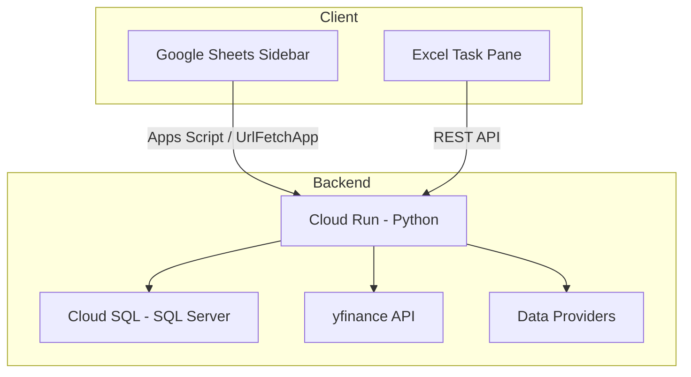

<div align="center">

# 📋 StockData Google Sheets Add-on

**Google Sheets sidebar add-on for real-time stock data, financial metrics, and technical indicators**


</div>

---

## Overview

A multi-platform financial data add-in for both **Microsoft Excel** and **Google Sheets**. Fetch real-time and historical stock data — including price data, financial metrics, and technical indicators — directly into your spreadsheets.

The solution is powered by a **Python backend on Google Cloud Run** and uses **Google Cloud SQL** for persistent data storage.

## Architecture



## Features

- 🔀 **Multi-Platform** — Works in both Microsoft Excel (task pane) and Google Sheets (sidebar)
- 📊 **Comprehensive Data** — Price data, financial metrics, and key ratios
- 📉 **Technical Indicators** — RSI, MACD, Bollinger Bands, Moving Averages, and more
- ☁️ **Serverless Backend** — Scalable Python service on Google Cloud Run
- 🗄️ **Persistent Storage** — Cloud SQL (SQL Server) for reliable data persistence
- 🔐 **OAuth2 Security** — Proper scoping and URL whitelisting

## Tech Stack

| Layer | Technology |
|-------|-----------|
| **Frontend** | HTML, CSS, JavaScript |
| **Excel Integration** | Microsoft Office Add-in Platform |
| **Sheets Integration** | Google Apps Script |
| **Backend** | Python (Cloud Run) |
| **Database** | Cloud SQL (SQL Server) |
| **Data Sources** | yfinance, proprietary providers |
| **APIs** | Excel JavaScript API, Google Sheets API, UrlFetchApp |

## Project Structure

```
├── Code.gs              # Apps Script server-side logic
├── Sidebar.html         # Add-on UI (HTML/CSS/JS)
├── appsscript.json      # Apps Script manifest
└── manifest.xml         # Excel Add-in manifest
```

## Getting Started

### Google Sheets Add-on

1. Open Google Sheets → **Extensions** → **Apps Script**
2. Copy `Code.gs` and `Sidebar.html` into the script editor
3. Update `appsscript.json` with your backend URL
4. Deploy as an add-on or run directly from the editor

### Excel Add-in

1. Load `manifest.xml` via Excel's developer tools
2. The task pane connects to the Cloud Run backend automatically

### Backend Setup

```bash
# The backend runs on Cloud Run
# Service URL: excel-addin-backend-o5molvd7pa-el.a.run.app

# To deploy your own instance:
gcloud run deploy stockdata-backend \
  --source . \
  --region asia-south1
```

## Cloud Configuration

| Resource | Value |
|----------|-------|
| GCP Project | `plus-percent` |
| Cloud Run Service | `excel-addin-backend` |
| Cloud SQL Instance | SQL Server |
| Required APIs | Google Sheets API, Workspace Marketplace SDK |

## Related Projects

- [**NSE Stock Data Pipeline**](https://github.com/SuminPillai/nse-stock-data-pipeline) — Upstream data pipeline
- [**StockData Excel Add-in**](https://github.com/SuminPillai/stockdata-excel-addin) — Excel backend service
- [**StockData WebApp**](https://github.com/SuminPillai/stockdata-webapp) — Web interface

---

<div align="center">
  <p>Built with ❤️ by <a href="https://github.com/SuminPillai">Sumin Pillai</a> · <a href="https://alphaquantixanalytics.com">AlphaQuantix Analytics</a></p>
</div>
